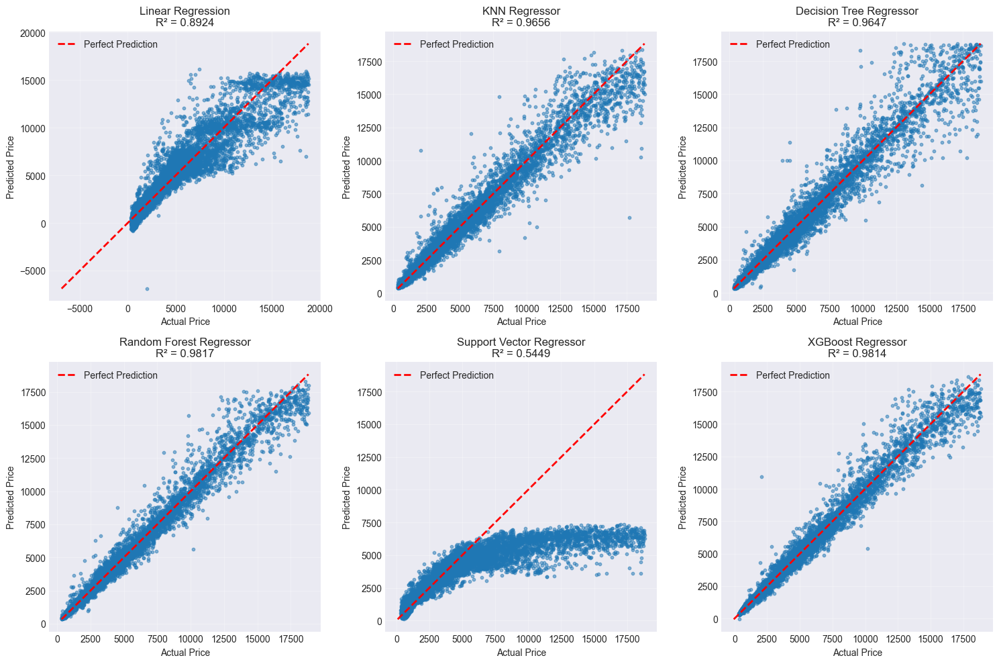
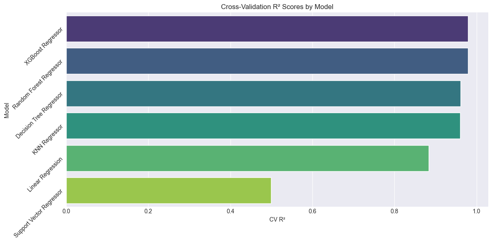

# Regression Model Comparison — Multiple Algorithms

  

<em>Actual vs Predicted Comparison Across Models</em>

This project focuses on **comparing multiple regression algorithms** to evaluate their performance on the same dataset.  
The goal was not just to train models, but to analyze how different algorithms perform and identify the most accurate and stable model.

---

## Project Objectives

- Train and compare multiple regression models  
- Evaluate models using performance metrics  
- Apply hyperparameter tuning using Grid Search  
- Analyze model performance using visualizations and cross-validation  

---

## Data Preparation Approach

The dataset required **basic preprocessing** before training the models.

### Data Cleaning

- Handled missing values  
- Ensured consistent data formatting  

---

### Feature Engineering & Transformation

- Encoded categorical variables  
- Scaled numerical features where necessary  

---

### Final Dataset

- Cleaned and structured dataset  
- Ready for regression models  

---

## Model Training

### Train-Test Split
- Split the dataset into:
  - **Training set**
  - **Test set**

---

### Models Used

#### Linear Regression
- Baseline model for regression  

#### KNN Regressor
- Distance-based regression model  

#### Decision Tree Regressor
- Captures non-linear relationships  

#### Random Forest Regressor
- Ensemble model for improved stability  

#### XGBoost Regressor
- Gradient boosting model for high performance  

#### Support Vector Regressor (SVR)
- Regression model using kernel methods  

---

## Model Evaluation

- Evaluated model performance using:
  - R² Score  
  - Cross-validation  

  

<em>Actual vs Predicted Comparison Across Models</em>

- Points closer to the diagonal line represent **better predictions**  
- Tree-based and boosting models show strong alignment with actual values  
- SVR shows weaker performance compared to other models  

---

## Cross-Validation Results

  

<em>Cross-Validation R² Comparison Across Models</em>

| Model                     | CV R²   | CV R² Std |
|--------------------------|---------|----------|
| XGBoost Regressor        | 0.979655 | 0.000750 |
| Random Forest Regressor  | 0.978980 | 0.001041 |
| Decision Tree Regressor  | 0.960876 | 0.002805 |
| KNN Regressor            | 0.959666 | 0.001621 |
| Linear Regression        | 0.883848 | 0.001736 |
| Support Vector Regressor | 0.498684 | 0.006529 |

---

## Hyperparameter Tuning (Grid Search)

- Applied **Grid Search** to optimize model performance  
- Tuned key hyperparameters for tree-based and boosting models  

| Model                     | Best CV R² | Best Hyperparameters |
|--------------------------|-----------|---------------------|
| XGBoost Regressor        | 0.9807    | learning_rate=0.1, max_depth=7, n_estimators=200, subsample=1.0 |
| Random Forest Regressor  | 0.9791    | max_depth=20, min_samples_leaf=1, min_samples_split=5, n_estimators=200 |
| Decision Tree Regressor  | 0.9681    | max_depth=20, min_samples_leaf=4, min_samples_split=10 |

- Grid Search significantly improved model performance  
- XGBoost achieved the best results after tuning  
- Proper hyperparameter selection plays a key role in model accuracy and generalization  

---

## Key Insights

- XGBoost and Random Forest achieved the highest performance  
- Tree-based and boosting models outperform simpler models  
- Linear Regression provides a solid baseline but lacks flexibility  
- SVR struggled with this dataset compared to other models  
- Cross-validation confirms model stability and consistency  

---

## Tools Used

- **Python**
  - pandas, numpy  
- **Machine Learning**
  - scikit-learn (LinearRegression, KNN, DecisionTree, RandomForest, SVR)  
  - XGBoost  
- **Evaluation**
  - r2_score  
  - cross_val_score  
- **Optimization**
  - GridSearchCV  

---

## Dataset

- Dataset used for regression analysis : [diamonds Dataset](../assets/Regression-model-comparison/diamonds.csv) 
- Includes numerical and categorical features  

Target variable:
- Continuous variable ( price )

---

## Project Files

- Jupyter Notebook (`.ipynb`)  
- Dataset: [diamonds Dataset](../assets/Regression-model-comparison/diamonds.csv)

---

## Author

**Adham Nassar**  
[LinkedIn](https://www.linkedin.com/in/adham-nassar-83ba54347)  

This project demonstrates strong understanding of **regression algorithms, model comparison, and hyperparameter tuning**, with a focus on selecting the most effective model for real-world problems.
