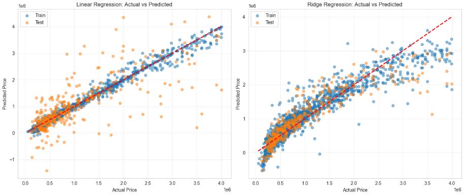

# Car Price Prediction — Linear & Ridge Regression

  

<em>Linear vs Ridge Regression — Actual vs Predicted Comparison</em>

This project focuses on **predicting car prices** using regression models, with a strong emphasis on **data preprocessing and feature engineering**.  
The goal was not just to build a model, but to transform raw, messy data into a **clean, structured dataset suitable for machine learning**.

Machine_Learning_Projects\assets\car-price-prediction-linear-regression\Linear_Ridge_Regression_Actual_vs_Predicted.png

---

## Project Objectives

- Predict car prices using **Linear Regression and Ridge Regression**  
- Perform **extensive data cleaning and preprocessing**  
- Handle missing values and inconsistent data formats  
- Encode categorical variables effectively  
- Build and evaluate regression models  

---

## Data Preparation Approach

The dataset required **significant preprocessing**, making this the most important part of the project.

### Data Cleaning

- Identified and handled **missing values** across multiple columns  
- Removed irrelevant or inconsistent entries  
- Standardized column formats for consistency  

---

### Feature Engineering & Transformation

A large portion of the work focused on transforming raw features into usable numerical inputs:

#### Numerical Features
- Converted data types where necessary (e.g., string → numeric)  
- Handled outliers and unrealistic values  
- Applied scaling where needed for model stability  

#### Categorical Features
- Identified key categorical variables such as:
  - Car brand  
  - Fuel type  
  - Transmission  
- Applied **One-Hot Encoding** to convert them into numerical format  

---

### Advanced Preprocessing (Key Highlight)

- Cleaned complex columns containing mixed formats (text + numbers)  
- Extracted meaningful numerical values from string-based features  
- Ensured all features were **fully numeric and model-ready**  
- Removed inconsistencies that could negatively impact model performance  

This step was critical in improving model accuracy and ensuring reliable predictions.

---

### Final Dataset

- Fully cleaned and numeric dataset  
- No missing values  
- Ready for regression modeling  

---

## Model Training

### Train-Test Split
- Split the dataset into:
  - **Training set**
  - **Test set**

---

### Models Used

#### Linear Regression
- Baseline model to understand relationships between features and price  

#### Ridge Regression
- Regularized version of Linear Regression to:
  - Reduce overfitting  
  - Improve generalization  
  - Handle multicollinearity  

---

## Model Evaluation

- Evaluated model performance using:
  - **Actual vs Predicted comparison**
  - Training vs Test behavior  

  

<em>Linear vs Ridge Regression — Actual vs Predicted Comparison</em>

- Points closer to the diagonal line represent **better predictions**  
- Linear Regression shows higher variance, especially on test data  
- Ridge Regression produces **more stable and consistent predictions**  

This clearly demonstrates the effect of **regularization in improving model performance**.

---

## Key Insights

- Data preprocessing has a **major impact on regression performance**  
- Cleaning and encoding features is essential for real-world datasets  
- Ridge Regression improves stability compared to standard Linear Regression  
- Feature quality is often more important than model complexity  

---

## Tools Used

- **Python**
  - pandas, numpy  
- **Machine Learning**
  - scikit-learn (LinearRegression, Ridge, train_test_split)  
- **Preprocessing**
  - OneHotEncoder / get_dummies  
  - StandardScaler  

---

## Dataset

- Source: Car price dataset  
- Features include:
  - Car brand  
  - Fuel type  
  - Transmission  
  - Engine specifications  
  - Mileage  
  - Other vehicle attributes  

Target variable:
- `price` → car selling price  

---

## Project Files

- Jupyter Notebook (`.ipynb`)  
- Trained Model (`.pkl`)  
- Dataset: `../assets/heart-disease-classification-logistic-regression/car_details_v4.csv`  

---

## Author

**Adham Nassar**  
[LinkedIn](https://www.linkedin.com/in/adham-nassar-83ba54347)  

This project demonstrates strong skills in **data preprocessing, feature engineering, and regression modeling**, with a focus on transforming real-world data into **high-quality inputs for machine learning models**.