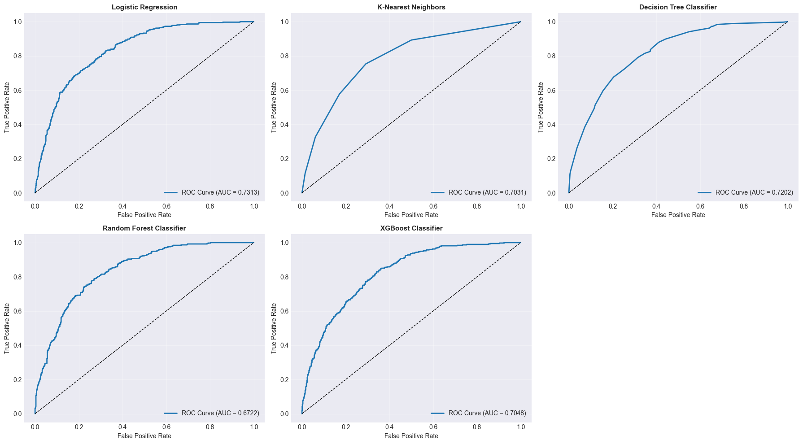
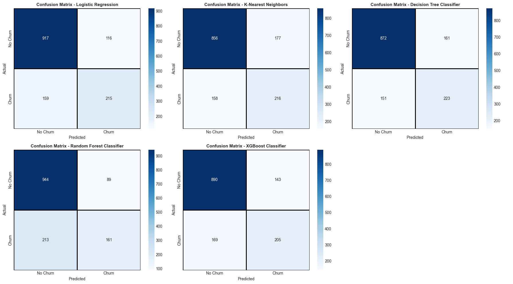

# Classification Model Comparison — Multiple Algorithms

  

<em>ROC Curve Comparison Across Models</em>

This project focuses on **comparing multiple classification algorithms** to evaluate their performance on the same dataset.  
The goal was not just to train models, but to analyze how different algorithms behave and identify the best-performing model.

---

## Project Objectives

- Train and compare multiple classification models  
- Evaluate models using key performance metrics  
- Analyze trade-offs between precision, recall, and F1-score  
- Visualize model performance using ROC curves and confusion matrices  

---

## Data Preparation Approach

The dataset required **proper preprocessing** before training the models.

### Data Cleaning

- Identified and handled **missing values**  
- Removed inconsistent entries  
- Ensured data quality and consistency  

---

### Feature Engineering & Transformation

A large portion of the work focused on preparing the dataset for modeling:

#### Numerical Features
- Scaled numerical features where necessary  
- Ensured consistent data types  

#### Categorical Features
- Encoded categorical variables into numerical format  
- Prepared features to be compatible with machine learning models  

---

### Final Dataset

- Cleaned and structured dataset  
- Ready for classification models  

---

## Model Training

### Train-Test Split
- Split the dataset into:
  - **Training set**
  - **Test set**

---

### Models Used

#### Logistic Regression
- Baseline model for classification  

#### K-Nearest Neighbors (KNN)
- Distance-based classification model  

#### Decision Tree Classifier
- Tree-based model capturing non-linear patterns  

#### Random Forest Classifier
- Ensemble model improving stability and performance  

#### XGBoost Classifier
- Gradient boosting model for improved accuracy  

---

## Model Evaluation

- Evaluated model performance using:
  - Accuracy  
  - Precision  
  - Recall  
  - F1-Score  
  - ROC AUC Score  

  

<em>ROC Curve Comparison Across Models</em>

- ROC curves show the trade-off between true positive rate and false positive rate  
- Logistic Regression achieved the best overall performance based on ROC AUC  

---

  

<em>Confusion Matrix Comparison Across Models</em>

- Confusion matrices provide deeper insight into prediction errors  
- Helps analyze false positives and false negatives across models  

---

## Model Comparison Results (Sorted by F1-Score)

| Model                     | Accuracy | Precision | Recall  | F1-Score | ROC AUC Score |
|--------------------------|----------|-----------|---------|----------|---------------|
| Logistic Regression      | 0.804549 | 0.649547  | 0.574866| 0.609929 | 0.731286      |
| K-Nearest Neighbors      | 0.761905 | 0.549618  | 0.577540| 0.563233 | 0.703097      |
| Decision Tree Classifier | 0.778252 | 0.580729  | 0.596257| 0.588391 | 0.720200      |
| Random Forest Classifier | 0.785359 | 0.644000  | 0.430481| 0.516026 | 0.672162      |
| XGBoost Classifier       | 0.778252 | 0.589080  | 0.548128| 0.567867 | 0.704848      |

---

## Model Comparison Results (Sorted by ROC AUC Score)

| Model                     | Accuracy | Precision | Recall  | F1-Score | ROC AUC Score |
|--------------------------|----------|-----------|---------|----------|---------------|
| Logistic Regression      | 0.804549 | 0.649547  | 0.574866| 0.609929 | 0.731286      |
| Decision Tree Classifier | 0.778252 | 0.580729  | 0.596257| 0.588391 | 0.720200      |
| XGBoost Classifier       | 0.778252 | 0.589080  | 0.548128| 0.567867 | 0.704848      |
| K-Nearest Neighbors      | 0.761905 | 0.549618  | 0.577540| 0.563233 | 0.703097      |
| Random Forest Classifier | 0.785359 | 0.644000  | 0.430481| 0.516026 | 0.672162      |

---

## Key Insights

- Logistic Regression performed best overall based on ROC AUC and F1-score  
- Tree-based models showed different strengths in precision and recall  
- KNN performance depends heavily on data distribution  
- Model selection depends on the trade-off between:
  - False positives vs false negatives  
  - Precision vs recall  

---

## Tools Used

- **Python**
  - pandas, numpy  
- **Machine Learning**
  - scikit-learn (LogisticRegression, KNN, DecisionTree, RandomForest)  
  - XGBoost  
- **Evaluation**
  - classification_report  
  - confusion_matrix  
  - roc_curve, auc  

---

## Dataset

- Dataset used for classification analysis  
- Includes features for predicting binary outcomes  

Target variable:
- Binary classification target ( churn )

---

## Project Files

- Jupyter Notebook (`.ipynb`)  
- Trained Model (`.pkl`)  
- Dataset: [Telco Customer Churn Dataset](../assets/classification-model-comparison/Telco-Customer-Churn.csv)  

---

## Author

**Adham Nassar**  
[LinkedIn](https://www.linkedin.com/in/adham-nassar-83ba54347)  

This project demonstrates strong understanding of **classification algorithms, model evaluation, and performance comparison**, with a focus on selecting the most appropriate model for real-world problems.