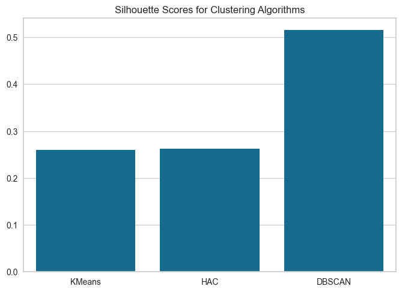
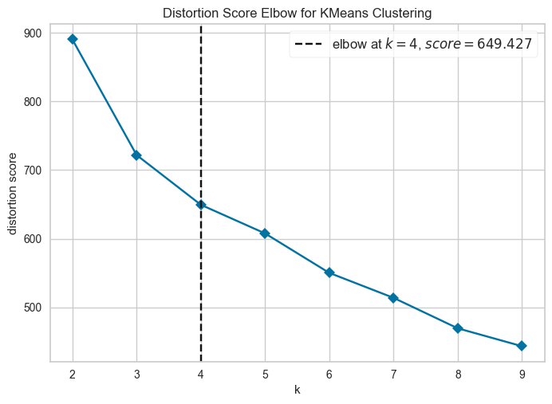
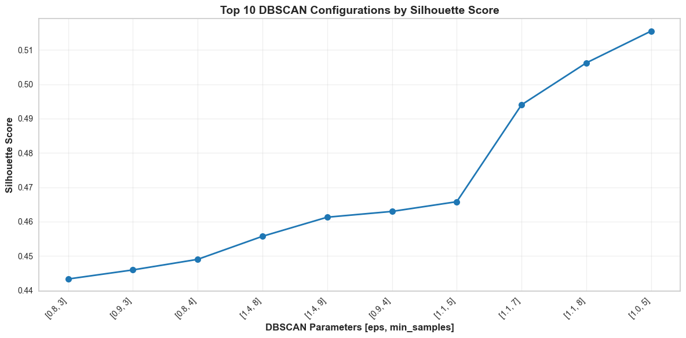
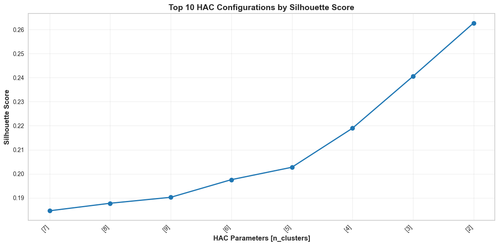

# Unsupervised Clustering Model Comparison — Multiple Algorithms

  

<em>Silhouette Score Comparison Across Clustering Algorithms</em>

This project focuses on **comparing multiple unsupervised clustering algorithms** to evaluate how well they group similar data points.  
The goal was not just to apply clustering techniques, but to analyze how different algorithms perform and identify the most suitable approach.

---

## Project Objectives

- Apply and compare multiple clustering algorithms  
- Evaluate clustering quality using performance metrics  
- Identify the optimal number of clusters for KMeans  
- Analyze differences between clustering techniques  

---

## Data Preparation Approach

The dataset required **basic preprocessing** before applying clustering algorithms.

### Data Cleaning

- Handled missing (null) values  
- Ensured consistent data formatting  
- Scaled features to reduce skewness and improve distribution  

---

### Feature Engineering & Transformation

- Applied feature scaling to normalize data distribution  
- Prepared dataset for distance-based clustering algorithms  
---

### Final Dataset

- Cleaned and normalized dataset  
- Ready for clustering analysis  

---

## Clustering Models

### KMeans Clustering
- Partition-based clustering algorithm  
- Requires specifying the number of clusters  

  

<em>Elbow Method for Optimal Number of Clusters</em>

- Used the **Elbow Method** to determine the optimal number of clusters  
- Optimal number of clusters identified at **k = 4**

---

### DBSCAN
- Density-based clustering algorithm  
- Automatically detects clusters of varying shapes  
- Handles noise and outliers effectively  

  

<em>Top DBSCAN Configurations by Silhouette Score</em>

- Tested multiple combinations of `eps` and `min_samples`  
- Performance improved as parameters were tuned  
- Best results achieved with optimized density parameters  

---

### Agglomerative Clustering (HAC)
- Hierarchical clustering approach  
- Builds clusters step by step using a bottom-up approach  

  

<em>Top HAC Configurations by Silhouette Score</em>

- Evaluated different numbers of clusters  
- Performance improved with fewer, well-defined clusters  
- Optimal clustering achieved at lower cluster counts  

---

## Model Evaluation

Clustering performance was evaluated using:

- **Silhouette Score**

  

<em>Silhouette Score Comparison Across Clustering Algorithms</em>

---

## Clustering Results

| Model                     | Silhouette Score |
|--------------------------|------------------|
| KMeans                   | 0.2599             |
| Agglomerative Clustering | 0.2627             |
| DBSCAN                   | 0.5155             |

---

## Key Insights

- DBSCAN achieved the highest silhouette score, indicating better cluster separation  
- KMeans and Agglomerative Clustering performed similarly  
- Density-based clustering (DBSCAN) handled the dataset more effectively  
- DBSCAN performance is highly sensitive to parameter tuning (`eps`, `min_samples`)  
- HAC performance depends strongly on the number of clusters selected  
- Choosing the right clustering algorithm depends on data distribution and structure  

---

## Tools Used

- **Python**
  - pandas, numpy  
- **Machine Learning**
  - scikit-learn (KMeans, DBSCAN, AgglomerativeClustering)  
- **Evaluation**
  - silhouette_score  

---

## Dataset

- Dataset used for clustering analysis  
- Includes numerical features for grouping similar data points  

---

## Project Files

- Jupyter Notebook (`.ipynb`)  
- [Dataset](../assets/unsupervised-clustering-model-comparison/Country-data.csv)

---

## Author

**Adham Nassar**  
[LinkedIn](https://www.linkedin.com/in/adham-nassar-83ba54347)  

This project demonstrates strong understanding of **unsupervised learning, clustering algorithms, and model evaluation**, with a focus on selecting the most appropriate clustering technique for real-world data.